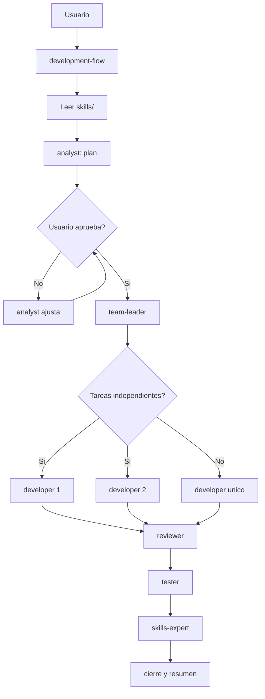

# Arquitectura del Flujo de Agentes

Este documento define como trabajan juntos los agentes de `.agents/` y los
skills de `skills/`. La idea no es agregar burocracia: es hacer que cada cambio
tenga analisis, plan, ejecucion, revision, pruebas y aprendizaje cuando aplica.

## Principios

- `skills/` manda sobre el estilo tecnico, arquitectura, naming y criterios de entrega.
- `skills/development-flow/SKILL.md` se dispara siempre para tareas de desarrollo.
- Los agentes coordinan el flujo; los skills definen como se debe trabajar.
- El `analyst` siempre arma un plan antes de ejecutar.
- El plan necesita aprobacion explicita del usuario.
- El `team-leader` no continua con ejecucion hasta que el plan este aprobado.
- El `team-leader` informa estado durante todo el flujo.
- Al final, `skills-expert` revisa si lo aprendido debe quedar documentado en `skills/`.
- Cada agente selecciona y declara las skills que necesita para su tarea actual.
- Cada agente usa el perfil de modelo recomendado para su rol si la herramienta lo permite.

## Flujo General

```text
+----------------+
| Usuario       |
| pide trabajo  |
+-------+--------+
        |
        v
+---------------------------+
| development-flow           |
| inicia el proceso          |
| lee skills/                |
+-------------+-------------+
              |
              v
+---------------------------+
| analyst                   |
| valida coherencia          |
| divide alcance             |
| propone plan               |
+-------------+-------------+
              |
              v
+---------------------------+
| Gate de aprobacion         |
| usuario aprueba el plan?   |
+------+--------------------+
       |
       +-- No --> analyst ajusta el plan
       |          y vuelve al gate
       |
       +-- Si
              |
              v
+---------------------------+
| team-leader               |
| traduce a tareas tecnicas  |
| define ownership           |
| decide paralelismo         |
| reporta status             |
+-------------+-------------+
              |
              v
+---------------------------+
| developer(s)              |
| ejecutan tareas aisladas   |
| validan cambios locales    |
+-------------+-------------+
              |
              v
+---------------------------+
| reviewer                  |
| revisa specs y plan SDD        |
| detecta riesgos y gaps     |
+-------------+-------------+
              |
              v
+---------------------------+
| tester                    |
| crea/corrige/elimina tests |
| valida comportamiento      |
+-------------+-------------+
              |
              v
+---------------------------+
| skills-expert             |
| actualiza skills si aplica |
| elimina redundancias       |
+-------------+-------------+
              |
              v
+---------------------------+
| Cierre                    |
| resumen + validaciones     |
| skills/agentes usados      |
+---------------------------+
```

## Gate de Aprobacion

El gate evita que Codex implemente una solucion grande sin confirmar primero si
el alcance tiene sentido.

```text
Usuario pide cambio
        |
        v
development-flow lee skills/
        |
        v
analyst analiza el pedido
        |
        v
analyst entrega plan
        |
        v
Usuario decide
        |
        +-- pide cambios --> analyst ajusta plan
        |
        +-- aprueba ------> team-leader ejecuta el flujo tecnico
```

Regla: si el usuario no aprueba, no hay ejecucion tecnica. Solo se ajusta el
plan hasta que quede aprobado.

## Bucle del Agente

Cada agente trabaja con el mismo ciclo base. Cambia la salida de cada rol, pero
no cambia la disciplina del proceso.

```text
        +------------------+
        | 1. Leer contexto |
        +--------+---------+
                 |
                 v
        +------------------+
        | 2. Entender      |
        |    objetivo      |
        +--------+---------+
                 |
                 v
        +------------------+
        | 3. Planificar    |
        |    el siguiente  |
        |    paso          |
        +--------+---------+
                 |
                 v
        +------------------+
        | 4. Ejecutar      |
        |    accion        |
        +--------+---------+
                 |
                 v
        +------------------+
        | 5. Validar       |
        |    resultado     |
        +--------+---------+
                 |
                 v
        +------------------+
        | 6. Reportar      |
        |    estado        |
        +--------+---------+
                 |
                 v
        +------------------+
        | 7. Aprender      |
        |    si aplica     |
        +--------+---------+
                 |
                 v
        +--------------------------+
        | Hay mas trabajo para el  |
        | mismo agente?            |
        +--------+-----------------+
                 |
       +---------+----------+
       |                    |
       v                    v
  repetir ciclo       entregar al
  con nuevo contexto  siguiente agente
```

### Que Significa Cada Paso

| Paso | Significado practico |
| --- | --- |
| Leer contexto | Revisar skills, specs, plan, tasks, memoria y archivos relevantes. |
| Entender objetivo | Confirmar que se sabe que se debe producir y que queda fuera del alcance. |
| Planificar el siguiente paso | Elegir la accion mas chica que mueve el trabajo sin mezclar responsabilidades. |
| Ejecutar accion | Cambiar archivos, generar artefactos, revisar codigo o correr comandos segun el rol. |
| Validar resultado | Verificar que la accion produjo lo esperado y no rompio reglas del proyecto. |
| Reportar estado | Informar etapa, agente activo, tarea actual, bloqueos y proximo paso. |
| Aprender si aplica | Documentar en skills o memoria solo si aparece una regla reutilizable. |

## Seleccion de Skills por Agente

```text
agente recibe tarea
        |
        v
lee skills/SELECTING_SKILLS.md
        |
        v
elige skills minimas para el scope
        |
        v
declara skills seleccionadas en status
        |
        v
ejecuta con esas skills
        |
        v
si cambia el scope, agrega skill y reporta
```

La seleccion debe ser chica y suficiente. No cargar todas las skills para cada
subtarea si solo aplica backend, frontend o delivery.

Mapa minimo:

| Agente | Skills base |
| --- | --- |
| `analyst` | `development-flow`, `sdd-architecture` |
| `team-leader` | `development-flow`, `sdd-architecture` |
| `developer` | `development-flow`, `tdd-development`, skill tecnica asignada |
| `reviewer` | `development-flow`, `sdd-architecture`, skills del diff |
| `tester` | `development-flow`, `tdd-development`, skill de la suite |
| `skills-expert` | `development-flow`, `sdd-architecture`, skills afectadas |

## Responsabilidades Por Agente

| Agente | Entra cuando | Produce | No debe hacer |
| --- | --- | --- | --- |
| `analyst` | Llega un pedido nuevo o ambiguo | Plan de negocio/alcance aprobado por usuario | Implementar codigo antes de la aprobacion |
| `team-leader` | El plan ya fue aprobado | Tareas tecnicas, ownership, paralelismo, status y cierre | Ejecutar sin dividir cuando hay tareas independientes |
| `developer` | Hay tarea tecnica concreta | Codigo, docs o artefactos listos y validados localmente | Pisar archivos de otro developer |
| `reviewer` | Hay cambios completos para revisar | Hallazgos, riesgos, gaps y aprobacion/rechazo tecnica | Reescribir todo sin justificar |
| `tester` | Hay comportamiento que validar | Tests nuevos, corregidos o eliminados segun corresponda | Mantener tests falsos o desalineados |
| `skills-expert` | Termina el flujo o cambia una regla de trabajo | Skills actualizadas, simplificadas o sin cambios justificados | Convertir todo en skill sin valor reutilizable |

## Modelo Por Agente

| Agente | Perfil recomendado | Razonamiento | Motivo |
| --- | --- | --- | --- |
| `analyst` | Codex alto | high | Necesita detectar contradicciones y preparar un plan aprobable. |
| `team-leader` | Codex maximo disponible, preferentemente `gpt-5.5-codex` si existe | xhigh | Coordina tradeoffs, ownership, paralelismo y cierre. |
| `developer` | Codex estandar | medium | Ejecuta tareas acotadas con contexto tecnico especifico. |
| `reviewer` | Codex alto | high | Busca bugs, riesgos y gaps de tests. |
| `tester` | Codex estandar | medium | Ajusta tests y validaciones concretas. |
| `skills-expert` | Codex alto | high | Evita drift y mantiene skills descubribles. |

Si el modelo exacto no existe en la herramienta usada, se usa el disponible mas cercano al perfil.

## TDD Para Developers

Cuando `developer` escribe codigo productivo, debe usar `tdd-development`.

```text
test RED -> codigo minimo GREEN -> refactor con tests verdes
```

El resultado del developer debe incluir evidencia RED/GREEN o una excepcion aprobada.

## Paralelismo

El `team-leader` puede crear N `developer` cuando las tareas son independientes.
La condicion es que cada developer tenga ownership claro y no toque el mismo
archivo o contrato sin coordinacion.

```text
team-leader
    |
    +-- developer A --> backend / docs backend
    |
    +-- developer B --> frontend / docs frontend
    |
    +-- developer C --> tests / fixtures
    |
    v
reviewer integra la mirada completa
```

Si dos tareas comparten el mismo archivo, modulo o contrato critico, se ejecutan
en serie o se define un owner unico.

## Status Continuo

Durante el flujo, el `team-leader` debe informar estado con esta forma:

```text
Status:
- etapa: <analisis | plan | ejecucion | revision | testing | skills | cierre>
- agente activo: <analyst | team-leader | developer | reviewer | tester | skills-expert>
- tarea actual: <que se esta haciendo>
- skills seleccionadas: <lista corta>
- modelo/perfil: <perfil usado>
- bloqueo: <ninguno | descripcion>
- siguiente paso: <accion concreta>
```

El status no reemplaza el trabajo. Sirve para que el usuario sepa donde esta el
flujo, que camino tomo y que falta.

## Cierre Obligatorio

Al terminar, el `team-leader` entrega un resumen corto con:

- Que se hizo.
- Que archivos se tocaron.
- Que skills se aplicaron.
- Que agentes participaron.
- Que perfiles de modelo se usaron o si hubo fallback.
- Que camino tomo el flujo.
- Que validaciones se corrieron.
- Riesgos o pendientes, si existen.

## Diagrama Mermaid

Este bloque es opcional para visores que soporten Mermaid.



## Regla Final

Si hay conflicto entre un agente y un skill, gana el skill. Si aparece una regla
nueva que sirve para trabajos futuros, `skills-expert` decide si debe quedar en
`skills/` o en memoria.
