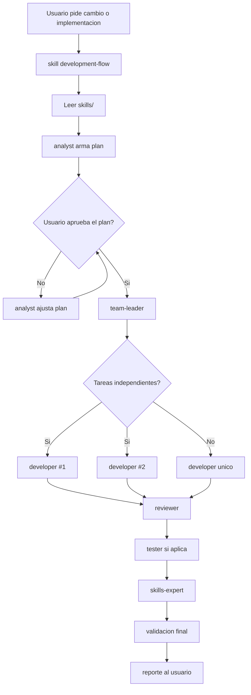

# Arquitectura del Flujo de Agentes

Este documento muestra como interactuan el skill `development-flow` y los agentes definidos en `.agents/`. Los agentes coordinan el trabajo; los `skills/` siguen definiendo reglas tecnicas y de arquitectura.

## Flujo Principal

```text
Usuario
  |
  v
skills/development-flow/SKILL.md
  |
  v
Leer skills/
  |
  v
analyst
  - valida coherencia
  - divide scope
  - genera plan
  |
  v
Usuario aprueba el plan?
  |
  +-- No --> analyst ajusta plan --> vuelve a pedir aprobacion
  |
  +-- Si
       |
       v
     team-leader
       - traduce a tareas tecnicas
       - define ownership
       - decide paralelismo
       - reporta status continuo
       |
       v
     Hay tareas independientes?
       |
       +-- Si --> developer #1
       |          developer #2
       |          developer #N
       |
       +-- No --> developer unico
                    |
                    v
                 reviewer
                    |
                    v
                 Requiere tests?
                    |
                    +-- Si --> tester
                    |
                    +-- No
                         |
                         v
                 skills-expert
                    - revisa skills/
                    - actualiza si cambio el flujo o arquitectura
                    - elimina redundancias si aparecen
                         |
                         v
                 validacion final
                         |
                         v
                 resumen final al usuario
                    - que se hizo
                    - skills aplicadas
                    - agentes usados
                    - camino tomado
                    - validaciones y riesgos
```

## Gate de Aprobacion

```text
Usuario              development-flow          analyst          team-leader
   |                        |                     |                  |
   | solicita desarrollo    |                     |                  |
   |----------------------->|                     |                  |
   |                        | lee skills/         |                  |
   |                        |-------------------->|                  |
   |                        | pide analisis       |                  |
   |                        |-------------------->|                  |
   |                        |                     | arma plan        |
   |                        |                     |------------------|
   | recibe plan            |                     |                  |
   |<---------------------------------------------|                  |
   |                        |                     |                  |
   | aprueba plan           |                     |                  |
   |--------------------------------------------->|                  |
   |                        |                     | entrega plan     |
   |                        |                     |----------------->|
   |                        |                     |                  |

Si el usuario NO aprueba:

Usuario              analyst
   |                    |
   | pide cambios       |
   |------------------->|
   |                    | ajusta plan
   | recibe nuevo plan  |
   |<-------------------|
```

## Responsabilidades

```text
+------------------+       +---------------------------+
| analyst          | ----> | plan aprobado por usuario |
| negocio/scope    |       +---------------------------+
+------------------+                     |
                                         v
+------------------+       +---------------------------+
| team-leader      | ----> | tareas tecnicas           |
| ownership        |       | paralelismo               |
| status continuo  |       | resumen final             |
+------------------+       +---------------------------+
                                         |
                                         v
+------------------+       +---------------------------+
| developer(s)     | ----> | codigo / docs / cambios   |
| implementacion   |       | validacion local          |
+------------------+       +---------------------------+
                                         |
                                         v
+------------------+       +---------------------------+
| reviewer         | ----> | hallazgos / aprobacion    |
| revision tecnica |       | gaps de tests             |
+------------------+       +---------------------------+
                                         |
                                         v
+------------------+       +---------------------------+
| tester           | ----> | tests creados/corregidos  |
| pruebas          |       | resultados                |
+------------------+       +---------------------------+
                                         |
                                         v
+------------------+       +---------------------------+
| skills-expert    | ----> | skills actualizadas       |
| mantenimiento    |       | redundancias eliminadas   |
+------------------+       +---------------------------+
```

## Mermaid Opcional

Algunos visores Markdown no renderizan Mermaid. Si tu visor lo soporta, este bloque sirve como version grafica alternativa.



## Reglas de Control

- `skills/development-flow/SKILL.md` se usa siempre al inicio de tareas de desarrollo.
- `analyst` siempre produce un plan antes de ejecutar desarrollo.
- El plan del `analyst` requiere aprobacion explicita del usuario.
- `team-leader` no continua hasta que el usuario apruebe el plan.
- `team-leader` reporta status continuo de etapa, agente activo, tarea, bloqueos y siguiente paso.
- `developer` puede instanciarse N veces solo si los scopes no pisan archivos.
- `reviewer` revisa contra specs, plan, tasks y riesgos.
- `tester` crea, corrige o elimina tests segun comportamiento real.
- `skills-expert` corre al final para mantener `skills/` actualizadas, descubribles y no redundantes.
- El cierre siempre incluye resumen de trabajo, skills aplicadas, agentes usados, camino tomado, validaciones y riesgos.
- Si aparece conflicto entre agentes y `skills/`, ganan los `skills/`.
