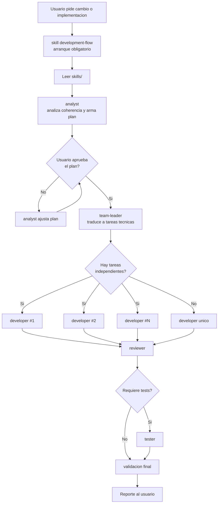
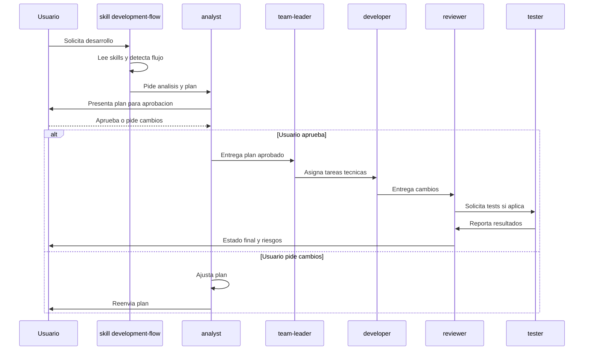
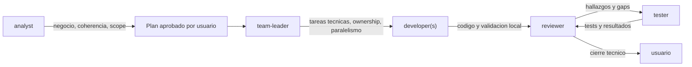

# Arquitectura del Flujo de Agentes

Este documento muestra como interactuan el skill `development-flow` y los agentes definidos en `.agents/`. Los agentes coordinan el trabajo; los `skills/` siguen definiendo reglas tecnicas y de arquitectura.

## Flujo Principal

## Gate de Aprobacion

## Responsabilidades

## Reglas de Control

- `skills/development-flow/SKILL.md` se usa siempre al inicio de tareas de desarrollo.
- `analyst` siempre produce un plan antes de ejecutar desarrollo.
- El plan del `analyst` requiere aprobacion explicita del usuario.
- `team-leader` no continua hasta que el usuario apruebe el plan.
- `developer` puede instanciarse N veces solo si los scopes no pisan archivos.
- `reviewer` revisa contra specs, plan, tasks y riesgos.
- `tester` crea, corrige o elimina tests segun comportamiento real.
- Si aparece conflicto entre agentes y `skills/`, ganan los `skills/`.
